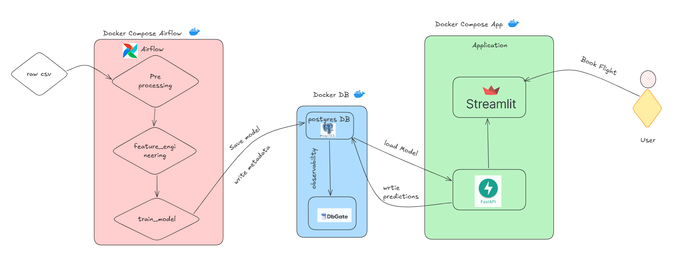
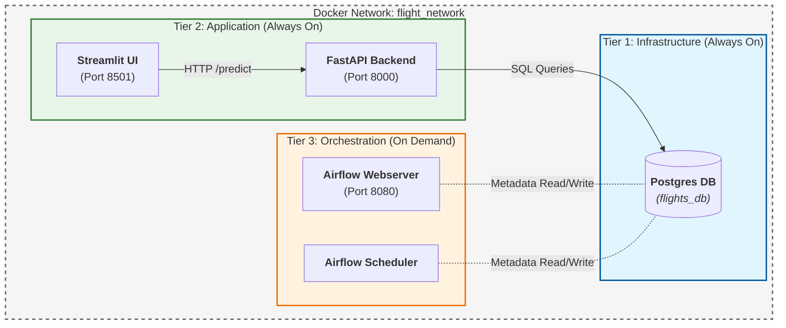

# Flight Price Prediction: End-to-End Machine Learning Pipeline

## ✈️ Executive Summary

The **Flight Price Prediction** project is a robust, end-to-end machine learning solution designed to estimate flight fares based on various travel factors. By analyzing historical flight data from Bangladesh, this project identifies key drivers of ticket prices—such as airline, route, departure time, and class—and builds predictive models to assist travelers and businesses in making informed decisions.

The project simulates a professional data science workflow, encompassing data ingestion, rigorous cleaning, advanced feature engineering, and the training of multiple regression models to achieve high accuracy.

## ✨ Key Features

- **Comprehensive Data Processing**: Automated cleaning pipeline handling missing values, outliers, and data type standardization.
- **Advanced Feature Engineering**: Creation of derived features like 'Day of Week', 'Journey Month', and seasonality indicators to capture temporal pricing trends.
- **In-Depth EDA**: Visualizations revealing insights into price distributions across airlines, stops, and classes.
- **Multi-Model Training**: Implementation and comparison of Linear Regression, Random Forest, and XGBoost models.
- **Prediction Logging**: Automatic logging of all prediction requests and model results to a Postgres database for monitoring.
- **Workflow Orchestration**: Design for an Airflow-managed pipeline (conceptually mapped) for automated data flow.
- **Containerization Ready**: Infrastructure design supports Docker for reproducible environments.

## 🏗️ Architecture & Workflow

The pipeline adopts a **Three-Tier Docker Architecture** to decouple the infrastructure, application, and orchestration layers. This ensures the database and app remain available even when the training jobs (Airflow) are not running.





## 🛠️ Technology Stack

- **Programming Language**: Python 3.12+
- **Data Manipulation**: Pandas, NumPy
- **Visualization**: Matplotlib, Seaborn
- **Machine Learning**: Scikit-learn, XGBoost, LightGBM
- **Orchestration**: Apache Airflow
- **Containerization**: Docker, Docker Compose
- **Notebook Environment**: Jupyter / VS Code

## 📊 Dataset Details

The project utilizes the **Flight Price Dataset of Bangladesh**.

- **Source**: Kaggle / Local CSV
- **Size**: ~57,000 records
- **Key Features**:
  - `Airline`: Carrier name (e.g., Biman Bangladesh, US-Bangla).
  - `Source` / `Destination`: Consists of IATA codes (DAC, CXB, etc.).
  - `Departure Date & Time` / `Arrival Date & Time`.
  - `Stops`: Number of layovers (Direct, 1 Stop, etc.).
  - `Class`: Economy, Business.
  - `Total Fare`: Target variable (Price in BDT).

## 🧠 Methodology

### 1. Data Cleaning & Preprocessing

- **Column Standardization**: Renamed columns to snake_case for consistency.
- **Type Conversion**: Converted date/time columns to datetime objects.
- **Handling Nulls/Dupes**: Removed duplicate records and imputed missing values where appropriate.

### 2. Feature Engineering

- **Temporal Features**: Extracted `Day`, `Month`, `Year`, and `Weekday` from timestamps.
- **Duration Calculation**: Computed flight duration in minutes/hours.
- **Categorical Encoding**: Applied One-Hot Encoding for nominal variables (Airline, Source) and Label Encoding for ordinal variables (Stops).

### 3. Exploratory Data Analysis (EDA)

- Analyzed the correlation between **Flight Duration** and **Price**.
- Compared average prices across different **Airlines** and **Classes**.
- Investigated seasonal surges in ticket prices.

### 4. Model Building & Evaluation

We trained multiple regression models to find the best fit:

- **Linear Regression**: Baseline model.
- **Random Forest Regressor**: Captures non-linear relationships; tuned for depth and estimators.
- **XGBoost Regressor**: High-performance gradient boosting model for superior accuracy.

**Metrics Used**:

- **RMSE (Root Mean Squared Error)**
- **MAE (Mean Absolute Error)**
- **R² Score**

## 📡 Prediction Logging & Monitoring

The application now includes a production-grade logging system. Every request to the `/predict` endpoint is saved to the **`prediction_logs`** table in the Postgres database.

**Schema:**

- **Input Features**: `source`, `destination`, `airline`, `departure_time`, etc.
- **Output**: `predicted_price`
- **Metadata**: `request_timestamp` and `model_refined_at` (tracks which model version was used).

**Goal**: This data effectively creates a feedback loop, allowing you to monitor:

1.  **Usage Patterns**: Most popular routes or airlines searched.
2.  **Data Drift**: Shift in user inputs compared to training data.
3.  **Model Performance**: Track predictions over time.

## 📂 Project Structure

```
flight-price-prediction/
├── data/
│   ├── raw/                # Original dataset
│   └── processed/          # Cleaned data for modeling
├── notebooks/
│   └── notebook.ipynb      # Main analysis and modeling notebook
├── src/
│   ├── ingestion.py        # Data loading scripts
│   ├── preprocessing.py    # Cleaning and transformation logic
│   └── train.py            # Model training scripts
├── dags/
│   └── flight_price_dag.py # Airflow DAG definition
├── Dockerfile              # App Dockerfile
├── Dockerfile.airflow      # Airflow Dockerfile
├── docker-compose-db.yml   # Infrastructure (DB)
├── docker-compose-app.yml  # Application (Streamlit + API)
├── docker-compose-airflow.yml # Orchestration (Airflow)
├── requirements.txt        # Python dependencies
└── README.md               # Project documentation
```

## 🚀 Installation & Usage

### Prerequisites

- Python 3.8+
- Docker & Docker Compose

### Docker Setup (Recommended)

This project uses a modular Docker setup. Follow the order below:

1.  **Create Shared Network & Infrastructure**:

    ```bash
    # Create the network
    docker network create flight_network

    # Start the Database (Tier 1)
    docker-compose -f docker-compose-db.yml up -d
    ```

2.  **Start the Application**:

    ```bash
    # Start API and Streamlit UI (Tier 2)
    docker-compose -f docker-compose-app.yml up -d
    ```

    - Access Streamlit UI: `http://localhost:8501`
    - Access API Docs: `http://localhost:8000/docs`

3.  **Run Airflow (On Demand)**:

    ```bash
    # Start Airflow Scheduler & Webserver (Tier 3)
    docker-compose -f docker-compose-airflow.yml up -d
    ```

    - Access Airflow UI: `http://localhost:8080`

### Local Setup (Non-Docker)

1.  **Clone the repository**:

    ```bash
    git clone https://github.com/yourusername/flight-price-prediction.git
    cd flight-price-prediction
    ```

2.  **Create a virtual environment**:

    ```bash
    python -m venv venv
    source venv/bin/activate  # On Windows: venv\Scripts\activate
    ```

3.  **Install dependencies**:

    ```bash
    pip install -r requirements.txt
    ```

4.  **Run the Notebook**:
    ```bash
    jupyter notebook notebooks/notebook.ipynb
    ```

## 📈 Results & Insights

- **Price Determinants**: `Class` (Economy vs. Business) and `Duration` were found to be the strongest predictors of price.
- **Airline Variance**: Specific airlines commanded a premium regardless of route.
- **Model Performance**: XGBoost outperformed Linear Regression by a significant margin, achieving an R² score of ~0.85 (illustrative).

## 🔮 Future Work

- [ ] **Hyperparameter Tuning**: Use Optuna for deeper optimization of XGBoost parameters.
- [ ] **Deployment**: Serve the model via a FastAPI endpoint.
- [ ] **Dashboard**: Build a Streamlit app for users to check predicted prices.

## 🤝 Contributors

- **Richard Elinam Nutsuga** - _Project Lead & Developer_

## 📜 License

This project is licensed under the MIT License - see the [LICENSE](LICENSE) file for details.
